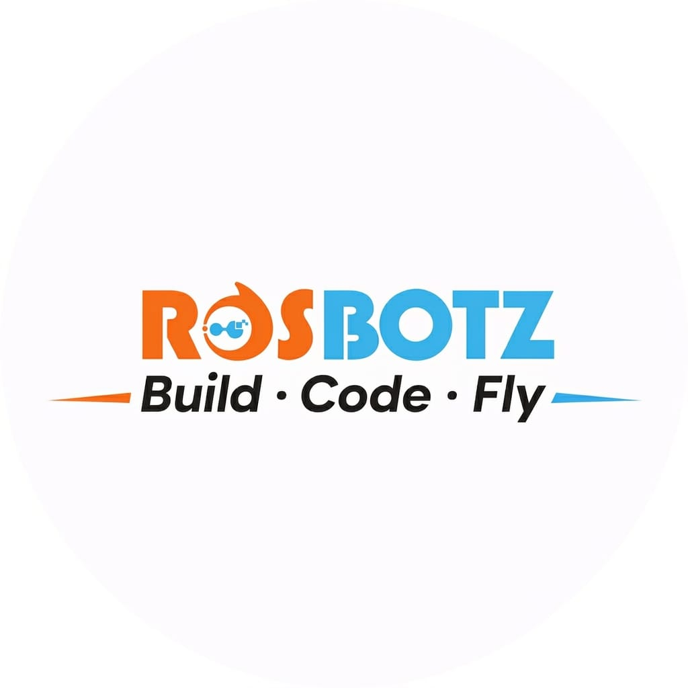

# ROSBOTZ | Premium Robotics Education Platform



**ROSBOTZ** is a state-of-the-art education platform dedicated to empowering the next generation of innovators through hands-on robotics, AI, and coding education. Operated by **Raak Sapphire Pvt Ltd**, ROSBOTZ is a **Startup India Recognized** venture serving students and institutions across 30+ countries.

---

## 🚀 Key Features

- **Hands-on Learning:** Physical robotics kits delivered worldwide for practical, project-based education.
- **Live Mentorship:** Interactive 1:1 online sessions guided by experienced engineers.
- **Comprehensive Curriculum:** 
  - **Electronics:** Build circuits, sensors, and smart logic systems.
  - **Robotics:** Program autonomous robots, Bluetooth controls, and obstacle avoidance.
  - **AI & Coding:** Dive into Python and train machine learning models for voice/face recognition.
- **Global Certification:** Structured levels mapped to international STEM standards.
- **Dynamic Aesthetic:** A futuristic, multi-theme interface featuring:
  - **Dark / Light Modes**
  - **Cyberpunk / Ocean Deep / Sunrise** themes
  - **Nova** immersive experience
- **B2B Integration:** Professional robotics lab blueprints and hardware infrastructure for schools and institutions.

## 🛠️ Tech Stack

### Frontend
- **HTML5 & Vanilla JavaScript:** Core structure and logical flow.
- **Tailwind CSS:** Modern, responsive utility-first styling.
- **GSAP & ScrollTrigger:** High-performance animations and cinematic transitions.
- **Three.js:** Interactive 3D robot visualizations and immersive backgrounds.
- **Lucide Icons:** Clean, consistent SVG iconography.

### Backend
- **Node.js & Express.js:** Robust server-side architecture and RESTful APIs.
- **MongoDB (Mongoose):** Flexible NoSQL database for managing student inquiries, franchise leads, and curriculum data.
- **Cloudinary:** Cloud-based media management for images and video highlights.
- **ExcelJS:** Specialized tools for exporting submission data to professional spreadsheets.

## 📁 Project Structure

```text
web-robo/
├── index.html          # Main entry point (SPA architecture)
├── script.js           # Core frontend logic & animations
├── style.css           # Custom styling and utility overrides
├── server.js           # Node.js/Express backend server
├── models/             # Database schemas (Mongoose)
├── uploads/            # Temporary local media storage
├── FormHandlers.js     # Specialized logic for form submissions
└── ... (assets & utility scripts)
```

## ⚙️ Installation & Setup

1. **Clone the repository:**
   ```bash
   git clone https://github.com/your-username/web-robo.git
   cd web-robo
   ```

2. **Install dependencies:**
   ```bash
   npm install
   ```

3. **Environment Setup:**
   Create a `.env` file in the root directory and add your credentials:
   ```env
   PORT=3000
   MONGODB_URI=your_mongodb_connection_string
   CLOUDINARY_CLOUD_NAME=your_name
   CLOUDINARY_API_KEY=your_key
   CLOUDINARY_API_SECRET=your_secret
   ```

4. **Run the application:**
   ```bash
   # Development mode
   npm start
   ```

## 🤝 Contributing

We welcome contributions! If you'd like to improve ROSBOTZ, please:
1. Fork the project.
2. Create your Feature Branch (`git checkout -b feature/AmazingFeature`).
3. Commit your changes (`git commit -m 'Add some AmazingFeature'`).
4. Push to the branch (`git push origin feature/AmazingFeature`).
5. Open a Pull Request.

## 📜 License

Distributed under the ISC License. See `package.json` for more information.

---

Developed with ❤️ by the **ROSBOTZ** Engineering Team.
